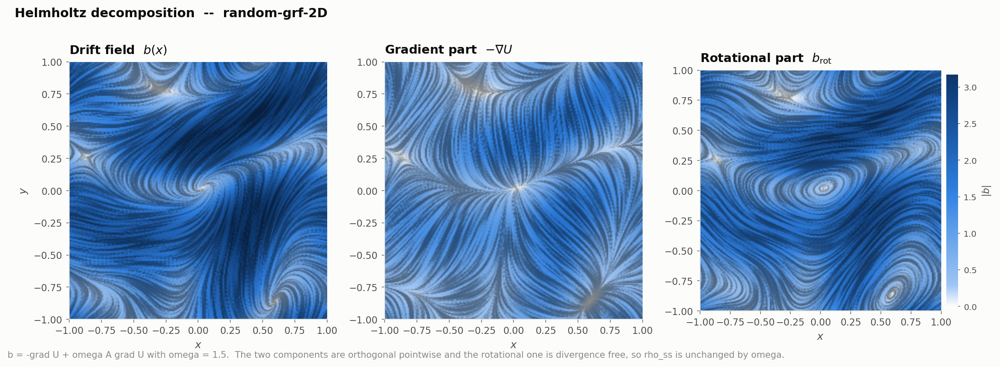

# Recovering drift fields from random walks

Particles move by `dx = b(x) dt + sqrt(2D) dW`. From their observed motion, recover the
vector field `b`. This repository simulates that problem and solves it six ways — from a
histogram to an amortised convolutional network to a diffusion model — measuring all of
them on the **same walkers**, so the differences are differences between methods and not
between experiments.

The instantaneous signal-to-noise ratio is about `1e-3`: over one step the drift
contributes `b*dt` and the noise `sqrt(2D*dt)`. Every method here is an exercise in
averaging away a thousandfold larger random term without averaging away the field.

📄 **[Project report (8 pages)](docs/drift_field_inference_report.pdf)** — the problem, the
approaches, the results.
📄 [Framework reference](docs/dfi_framework_reference.pdf) — the simulator, the data model,
the estimator contract, the metrics.
📄 [Error budget of rung 1](docs/binned_km_error_analysis.pdf) — the variance and both
biases in closed form, verified term by term against simulation.



---

## The headline

Normalised RMS error against the true field (`1.0` = "as good as predicting zero"), on one
2D random field, every method fitted to identical walkers. Snapshot methods get independent
positions matched in count plus the known `D`, and no time ordering.

| | 4.8M transitions | 16 walkers | 1024 walkers | `D` = 1.0 | σ_obs = 0.02 | `d` = 3 | `d` = 5 |
|---|---|---|---|---|---|---|---|
| binned Kramers–Moyal | 0.293 | 0.648 | 0.224 | 0.785 | 1.56 | 0.564 | 1.62 |
| local-linear kernel | 0.126 | 0.358 | 0.088 | 0.280 | 1.25 | 0.261 | 0.925 |
| basis projection (SFI) | 0.097 | 0.392 | 0.053 | 0.211 | 1.43 | 0.195 | 0.946 |
| MLP | 0.100 | 0.340 | 0.080 | 0.319 | 1.38 | 0.223 | 0.927 |
| CNN (per dataset) | 0.115 | 0.380 | 0.068 | 0.333 | 1.44 | 0.224 | — |
| **amortised CNN** | **0.060** | **0.257** | **0.043** | **0.134** | 0.63 | — | — |
| KDE score (snapshots) | 0.130 | 0.132 | 0.130 | 0.843 | 0.14 | 0.231 | 0.983 |
| **denoising score matching** | 0.072 | 0.194 | 0.072 | 0.164 | **0.08** | 0.142 | **0.625** |

**Three results worth your time.**

1. **Amortisation is the biggest single win, and it is prior knowledge, not a better
   estimator.** The same CNN that *loses* to an MLP when fitted to one dataset wins nearly
   every comparison once trained across 3000 simulated fields — and loses to the simplest
   kernel, by up to 1.9×, on fields from a generator it never saw. Its equivalent smoothing
   kernel keeps a *fixed width* as data grows and raises its gain from 0.60 to 0.93: a
   Wiener filter matched to the field statistics, not a bandwidth being tuned.
2. **At equilibrium, static positions beat increments.** `dx/dt` is dominated by noise; a
   position is not. Denoising score matching on snapshots reaches 0.072 where the best
   trajectory method gets 0.097 — and at `d = 5` it is the *only* method that recovers
   anything at all (0.625 against ~0.93 for everything else).
3. **Static positions are exactly blind to circulation.** Adding a rotational part leaves
   `rho_ss` bit-identical, so both snapshot estimators return *bit-identical* predictions
   for ω = 0…4 (largest difference: 0.0). That is information, not method quality — and the
   gap between the two families measures entropy production to within 2%.

Full comparison, ten findings and the limitations: [`outputs/SUMMARY.md`](outputs/SUMMARY.md).

---

## Quick start

```bash
pip install numpy scipy matplotlib pandas numba torch pytest
python -m pytest tests/ -q                           # 46 tests, ~3 min
python scripts/01_fields_and_diffusion.py            # the static figures
python scripts/03_local_estimator.py --quick         # one rung, end to end
```

```python
from dfi import random_grid_field, simulate, suggest_dt
from dfi.estimators import BasisProjection
from dfi.viz import use_style

use_style("light")                                   # or "dark"
field = random_grid_field(d=2, resolution=256, omega=1.5, seed=0)
traj  = simulate(field, n_walkers=2000, n_steps=4000,
                 dt=suggest_dt(field, D=0.3), D=0.3, burn_in=10.0)

est = BasisProjection().fit(traj)                    # never sees `field`
b_hat = est.predict(traj.x[:, 0])
```

Every estimator takes a `Trajectories` object and returns a field. The moment `fit` and
`predict` return sensible arrays, every figure, sweep and phase diagram in the project
works on a new method with no further wiring.

---

## The ladder

| Rung | Class | Consumes | Assumes |
|---|---|---|---|
| 1 | [`BinnedKramersMoyal`](dfi/estimators/local.py) | increments | `b` is constant inside a cell |
| 2 | [`KernelRegression`](dfi/estimators/local.py) | increments | `b` is smooth on one length scale |
| 3 | [`BasisProjection`](dfi/estimators/basis.py) (SFI) | increments | `b` lies in a Fourier basis |
| 4 | [`NeuralDrift`](dfi/estimators/neural.py) (MLP, CNN) | increments | smoothness from architecture + early stopping |
| 4b | [`AmortizedDrift`](dfi/estimators/amortised.py) | increments, binned | **what fields from this generator look like** |
| 5 | [`KDEScore`, `DenoisingScoreMatching`](dfi/estimators/score.py) | positions only, plus `D` | **equilibrium** (gradient drift) |

Each rung has its own study and its own output folder, each with a README carrying the
numbers behind every figure:

| | |
|---|---|
| [`outputs/binned_km/`](outputs/binned_km/) [`kernel_nw/`](outputs/kernel_nw/) [`kernel_ll/`](outputs/kernel_ll/) [`sfi/`](outputs/sfi/) [`nn_mlp/`](outputs/nn_mlp/) [`nn_cnn/`](outputs/nn_cnn/) | the six shared figures, per rung, on identical walkers |
| [`outputs/kernel/`](outputs/kernel/) | how a kernel and its bandwidth work; rung 2 against rung 1 |
| [`outputs/cnn_amortised/`](outputs/cnn_amortised/) | training, held-out fields, out-of-distribution, other generators, the learned smoothing kernel |
| [`outputs/score/`](outputs/score/) | identifiability, entropy production, snapshots vs the walkers' own positions |
| [`outputs/local_study/`](outputs/local_study/) | the side-by-side tables |

---

## Design decisions that changed the numbers

**The drift is built from scalars, never from two independent noise fields.**

```
b(x) = -grad U(x) + omega * A grad U(x),     A constant antisymmetric
```

Two identities hold pointwise and exactly: `div(A grad U) = 0` (antisymmetric contracted
with the symmetric Hessian) and `grad U . A grad U = 0`. So the second term is genuinely
divergence-free *and* everywhere orthogonal to `grad rho_ss`. Consequences, all free: the
Helmholtz decomposition is exact rather than estimated; `rho_ss = exp(-U/D)/Z` is exact for
**every** `omega` (verified to a Fokker–Planck residual of `2e-7`); and `field.with_omega(w)`
changes the dynamics while holding `rho_ss` *bit-identical*, which is what makes the
identifiability experiment airtight rather than suggestive.

**Band-limited fields with exact derivatives.** The potential is a Gaussian random field
filtered in Fourier space, differentiated spectrally, and evaluated by quintic B-splines.
Both choices were forced by measurement: that combination puts the ground-truth drift error
at `7e-6` relative, where cubic splines give `5e-4`. When the methods under test have
percent-level errors, the ground truth has to be orders of magnitude tighter. The spectrum
is Gaussian rather than power-law because with `slope=4` in 2D the second-derivative
variance diverges logarithmically and the field's gradient scale ends up set by the grid
resolution instead of by `correlation_length` (measured: `ell` 0.055 → 0.033 on refinement,
against 0.24 → 0.24 for the Gaussian spectrum).

**Observation interval and integration step are separate.** `simulate(..., dt, substeps=k)`
records at `dt` and integrates at `dt/k`. With `substeps=1` an `O(dt)` error in the
estimator is indistinguishable from an `O(dt)` error in the *simulator*, and you are
measuring your own integrator.

**Periodic torus with minimum-image increments.** No walker escapes and the whole domain
gets sampled, which removes the empty-tail-bin pathology from the comparison. The cost is
one piece of bookkeeping in exactly one place — `Box.displacement` — so a walker wrapping
an edge contributes its true small step rather than a box-sized jump.

**Cross-validation grouped by walker, never by sample.** Splitting increments at random
lets a held-out point sit one time step from its training neighbours, and the criterion
then rewards a bandwidth far too small. The one estimator that receives positions without
walker labels was bitten by exactly this (1.06 against 0.35 at a fixed bandwidth), and it
is reported as a defect rather than smoothed over.

---

## What the harness measures

`dfi.metrics.drift_error` returns a row per estimator. Three things it does that a plain
MSE does not:

- **Normalises by `RMS|b|`**, so `nrmse = 1.0` means "as good as predicting zero". The
  `ZeroDrift` baseline is on every plot for that reason — methods *do* score above 1 at
  small sample sizes, and a reader cannot tell without the line.
- **Decomposes the error along the field's own structure**, into gradient-direction and
  rotational-direction components. This is what turns the identifiability claim into two
  numbers: a snapshot method's error lives *entirely* in the rotational direction and grows
  precisely like `omega`, while its gradient-direction error stays flat.
- **Records the measure.** Errors under `rho_ss` and under the uniform measure can differ by
  an order of magnitude; the gap between them *is* the extrapolation penalty.

`OracleDrift` (returns the truth) and `ZeroDrift` (returns zero) are calibration references,
not methods. Run them first: if the oracle scores anything but machine precision, the bug is
in the metric.

---

## Layout

```
dfi/
  fields/          torus + minimum image, noise generators, the exact Helmholtz construction
  simulate.py      Euler-Maruyama, numpy + torch/GPU, step-size diagnostics
  trajectories.py  the (x, dx) container every estimator consumes
  estimators/      the interface, baselines, and rungs 1-5
  metrics.py       evaluation sets, error decomposition, error vs local density
  sweeps.py        config-grid runner with caching and resume
  viz/             design tokens, LIC flow texture, field/trajectory/sweep plots, animations
scripts/           01..09, each producing one output folder
tests/             46 tests (45 pass, 1 skips), including closed-form checks
docs/              three PDFs and their sources; build.sh rebuilds all of them
outputs/           figures and result tables, one folder per study
models/            the amortised CNN's weights
```

Two field backends share one interface: `GridDriftField` (d ≤ 3, drawable,
spline-interpolated) and `SpectralDriftField` (any d, mesh-free random Fourier features,
analytic derivatives, GPU). `sweeps.build_field` picks grid up to d = 3 and spectral above,
where an `n^d` grid is impossible. Measured at d = 8, N = 40 000: numpy 258 s, torch fp32
13.2 s (**19.6×**).

Trajectories are cached in `~/.cache/dfi/trajectories` (override with `DFI_TRAJ_CACHE`) so a
new estimator is fitted to exactly the walkers the others saw, without re-simulating. Sweep
rows are cached by configuration hash in `outputs/*/data/`, so re-running a study redraws
its figures without recomputing anything.

The cache, the raw `.npz` trajectory dumps and the animations are not in the repository —
scripts `01` and `02` regenerate them.

---

## Reproducing

| command | produces |
|---|---|
| `python scripts/01_fields_and_diffusion.py` | field, trajectory and snapshot figures |
| `python scripts/02_sweeps.py` | budget and rotation sweeps |
| `python scripts/03_local_estimator.py` | the six shared figures for every estimator |
| `python scripts/04_kernel_vs_binned.py` | rung 2 against rung 1, bandwidth selection |
| `python scripts/05_amortised_data.py` → `06_amortised_train.py` → `07_amortised_study.py` | rung 4b, from data to study |
| `python scripts/08_score_study.py` | identifiability, entropy production, positions |
| `python scripts/09_binned_error_analysis.py` | the rung 1 error budget |
| `sh docs/build.sh` | the three PDFs (needs `pdflatex`) |

Add `--quick` to any study script for a fast layout check.

## Status

All five rungs plus the amortised variant are implemented, studied and documented.
45 tests pass and 1 skips. What is worth doing next is listed at the end of
[`outputs/SUMMARY.md`](outputs/SUMMARY.md) and in §7 of the report.
