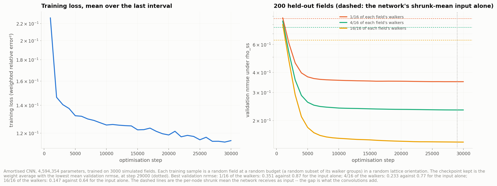
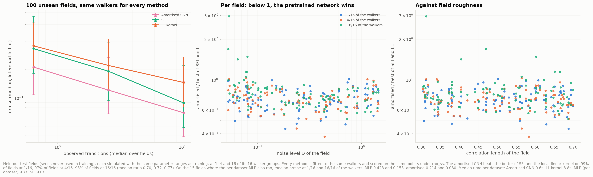
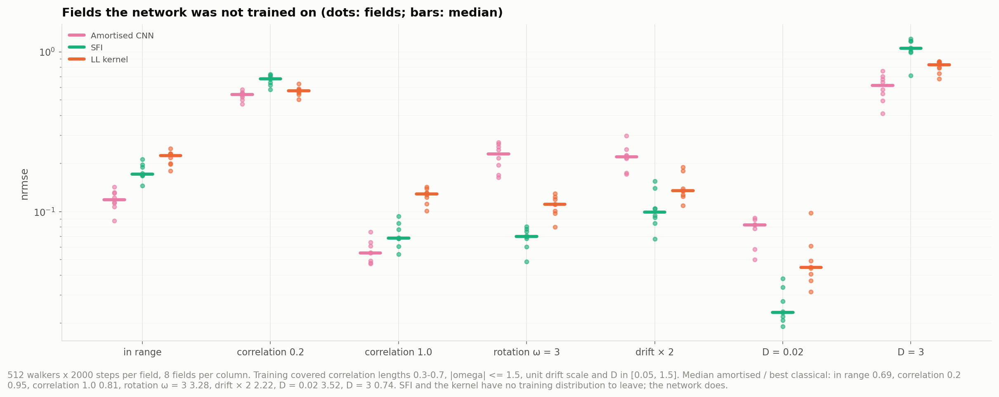
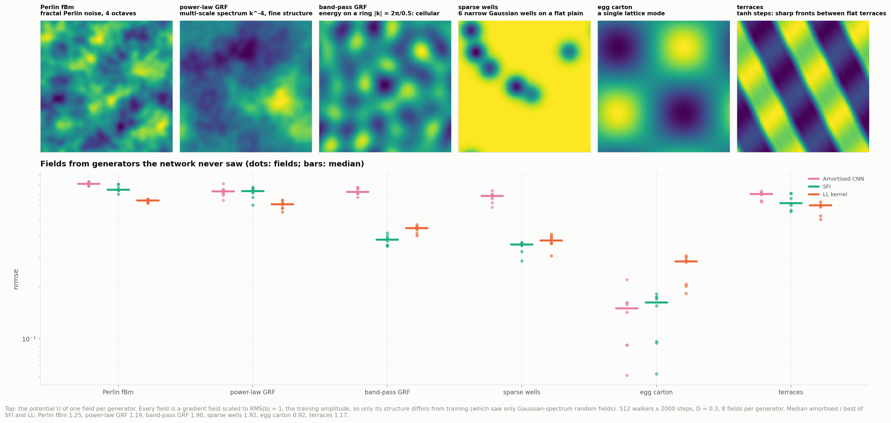
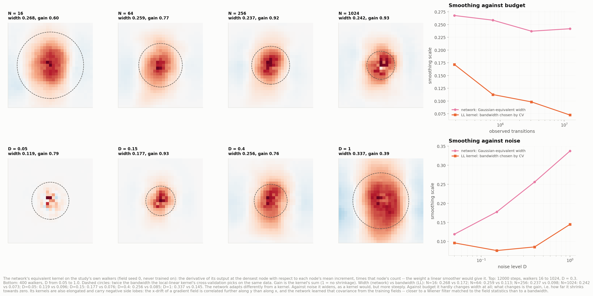

# Rung 4b — the amortised CNN

A convolutional network trained **once**, across thousands of simulated fields, to map a
dataset to its drift. Given new trajectories it runs one forward pass, with no training,
no smoothing choice and no look at the true field of the dataset being estimated. The
estimator is [`AmortizedDrift`](../../dfi/estimators/amortised.py); the weights are in
[`models/amortised_cnn_2d.pt`](../../models/amortised_cnn_2d.pt).

```bash
python scripts/05_amortised_data.py        # 3000 + 200 + 100 fields, ~27 min on 10 cores
python scripts/06_amortised_train.py       # 30k steps, ~3 h on an RTX 2060 (thermally throttled)
python scripts/07_amortised_study.py       # training, test fields, out-of-distribution, other generators, learned smoothing
python scripts/03_local_estimator.py --estimators amort    # the six shared figures
```

```python
from dfi.estimators import AmortizedDrift
est = AmortizedDrift().fit(traj)      # loads the weights; ~1 s
est.predict(x)
```

## How it is built

**Training data** ([`05_amortised_data.py`](../../scripts/05_amortised_data.py)). The data
is 3000 training, 200 validation and 100 test fields on the study's torus `[-1, 1]²`,
each a fresh random field with its own settings:

| | range | the study |
|---|---|---|
| correlation length | 0.3 – 0.7 | 0.45 |
| rotation `ω` | 0 for half; else −1.5 – 1.5 | 0 |
| noise `D` | 0.05 – 1.5, log-uniform | 0.05 – 1.5 |
| walkers × steps | {256, 1024} × {1000, 2000, 4000} | up to 1024 × 12000 |

Seeds start at 100000, so none of the study's fields (seeds 0–2) was ever seen.

**What is stored and what the network sees.** Trajectories are not kept. Per field, the
walkers are split into 16 groups, and each group's increments are splatted bilinearly
onto a 64 × 64 node lattice: counts `N_c`, summed `Δx/Δt` `Y_c`, and `Σ|Δx|²`. The input
has five channels built from those:
- a z-score, `Y/(σ√N)` (2 channels);
- a mean shrunk towards zero where data is thin, `Y/(N + σ²)` (2 channels);
- a data weight, `N/(N + σ²)` (1 channel).

`σ² = 2D/Δt` is estimated from the increments, not taken from the simulation.

**Target and loss.** The target is the true drift at the nodes. The loss is the squared
relative error weighted `0.8 ρ_ss + 0.2`: mostly where walkers go, with a floor
elsewhere. The true drift is used only here, on the simulated training fields.

**Network.** A periodic U-Net: circular padding, four resolution levels (64 → 8), residual
blocks, no normalisation layers (they would destroy the physical amplitude), 4.6M
parameters. Prediction between nodes is bilinear; interpolating the true field this way
costs a negligible nrmse of 0.002.

**Training** ([`06_amortised_train.py`](../../scripts/06_amortised_train.py)). Each sample
is a random field, a random budget (a random 1–16 of its 16 walker groups, log-uniform,
so 16k–4.1M transitions), and one of the 8 symmetries of the square lattice applied to
input and target together, vector components included.
- Optimiser: AdamW, 30k steps, batch 32, cosine learning rate, weight average (EMA 0.999).
- Checkpoint: the best mean validation nrmse.
- At prediction time the output is averaged over the 8 symmetries.
- Tests check that the statistics commute exactly with every symmetry and that group
  statistics add up.

## Training (figure 10)



| budget (of each validation field) | 1/16 | 4/16 | 16/16 |
|---|---|---|---|
| network | **0.351** | **0.233** | **0.147** |
| its shrunk-mean input alone | 0.87 | 0.77 | 0.64 |

Validation error falls fast for 5000 steps and flattens after ~10000. Training loss keeps
drifting down while validation stays flat: mild overfitting at most, never a rise. The
kept checkpoint is step 29000.

## On the study's walkers — the same data as every other rung

Every earlier rung and this network see exactly the same cached walkers. The study field
(seed 0) was never in training.

| | binned | LL | SFI | MLP | CNN (per dataset) | **amortised** |
|---|---|---|---|---|---|---|
| 4.8M transitions | 0.293 | 0.126 | 0.097 | 0.100 | 0.115 | **0.060** |

| `D` | 0.05 | 0.15 | 0.4 | 1.0 |
|---|---|---|---|---|
| LL | 0.067 | 0.080 | 0.160 | 0.280 |
| SFI | **0.025** | 0.043 | 0.108 | 0.211 |
| MLP | **0.025** | 0.057 | 0.129 | 0.319 |
| amortised | 0.031 | **0.038** | **0.074** | **0.134** |

| walkers × 12000 steps | 16 | 64 | 256 | 1024 |
|---|---|---|---|---|
| LL | 0.358 | 0.231 | 0.144 | 0.088 |
| SFI | 0.392 | 0.173 | 0.107 | 0.053 |
| MLP | 0.340 | 0.199 | 0.111 | 0.080 |
| amortised | **0.257** | **0.128** | **0.074** | **0.043** |

| sweeps, 4000 steps, 3 seeds | 16 → 1024 walkers | best `D` | σ_obs = 0.02 |
|---|---|---|---|
| LL | 0.516 → 0.139 | 0.05 (0.084) | 1.25 |
| SFI | 0.578 → 0.100 | 0.05 (0.042) | 1.43 |
| MLP | 0.541 → 0.117 | 0.05 (0.046) | 1.38 |
| amortised | **0.424 → 0.068** | 0.05 (**0.040**) | **0.63** |

- **It wins almost everywhere.** Its biggest gains are with little data and high noise:
  0.257 at 16 walkers, against 0.340 for the best per-dataset method, and 0.134 at
  `D = 1`, against 0.211.
- **Its one loss is the lowest noise level** (`D = 0.05`: 0.031 against SFI's 0.025).
  There the data is nearly noise-free where walkers go, and the network's prior has
  little left to add.
- **It is fastest by far:** ~1 s per dataset, against 10–150 s to fit the per-dataset
  networks.
- **It exceeds its training budget without trouble:** 12.3M transitions (1024 walkers)
  is 3× the largest budget seen in training, and still gives its best score, 0.043.

**Why it wins: it knows what fields look like.** Every per-dataset method assumes only
smoothness. This network has seen 3000 fields from the same generator and has learned
their statistics: amplitude, roughness, how the two drift components co-vary. That is
prior knowledge the other rungs don't have. Figure 13 shows what it does with it, and
figure 12 shows what happens when a field breaks the prior.

**Measurement noise shows the prior at work.** At `σ_obs = 0.02` every per-dataset method
converges to the biased target `b (1 + σ²/(DΔt))`, here 2.3× the real drift, and scores
above 1. The network never saw measurement noise in training, yet scores 0.63. Two
effects, measured on the same walkers (256 × 4000, `σ_obs = 0.02`):
1. **It over-estimates D.** Position noise inflates its estimate of `D` 2.27×, so it
   smooths and shrinks harder.
2. **It doesn't believe a drift that strong.** Given the true `D` instead, it still
   scores 0.76.

The second effect is most of it: a drift 2.3× stronger than any training field is
simply not believed. That is the same prior that should fail when a field really is
stronger — the "drift × 2" test below.

## Held-out test fields (figure 11)



100 fields never used in training, drawn from the same ranges as the training fields.
Each was simulated with its own seed and fitted at 1, 4 and 16 of its 16 walker groups
(median 64k, 256k and 1.0M transitions). Every method sees the same walkers and is scored
on the same points under `ρ_ss`.

| median nrmse | 1/16 | 4/16 | 16/16 |
|---|---|---|---|
| LL kernel | 0.357 | 0.222 | 0.147 |
| SFI | 0.334 | 0.192 | 0.089 |
| **amortised** | **0.213** | **0.122** | **0.070** |
| beats the better of SFI and LL on | 99% of fields | 97% | 93% |
| median ratio to the better of them | 0.70 | 0.72 | 0.77 |

On the 15 fields where the per-dataset MLP also ran, median nrmse at 1/16 and 16/16 of
the walkers: MLP 0.423 and 0.153, SFI 0.362 and 0.130, amortised **0.214** and **0.080**.

**Where it loses: nearly noise-free data with plenty of it.** 11 of 300 (field, budget)
pairs have the network behind the better classical fit. Seven of those are at the full
budget with `D < 0.1`, and the worst is 3× (field 88: `D = 0.053`, 4.1M transitions,
0.040 against SFI's 0.014). There the data pins the field down almost exactly, and the
remaining error is the network's own resolution. Its prior and its 64² output grid stop
helping, while SFI's exact Fourier basis keeps improving. The same pattern shows on the
study walkers at `D = 0.05`. Across all fields with `D < 0.1` at full budget, the median
ratio is still 0.91.

Per dataset the network takes 0.6 s, against ~9 s for SFI and the kernel and ~10 s for
the MLP.

## Outside the training distribution (figure 12)



Eight fields per column, 512 walkers × 2000 steps (1M transitions), each column breaking
one assumption of the training distribution:

| median nrmse | in range | correlation 0.2 | correlation 1.0 | rotation ω = 3 | drift × 2 | D = 0.02 | D = 3 |
|---|---|---|---|---|---|---|---|
| LL kernel | 0.224 | 0.570 | 0.129 | 0.111 | 0.135 | 0.045 | 0.831 |
| SFI | 0.172 | 0.680 | 0.068 | **0.070** | **0.099** | **0.023** | 1.053 |
| amortised | **0.118** | **0.540** | **0.055** | 0.230 | 0.221 | 0.082 | **0.615** |
| amortised / best | 0.69 | 0.95 | 0.81 | **3.3** | **2.2** | **3.5** | 0.74 |

The pattern is clean, and it is the price of the prior.

- **Departures towards "harder" survive.**
  - *Rougher fields* (correlation 0.2) defeat everyone at this budget, and the network
    still edges ahead.
  - *Much noisier data* (`D = 3`, twice the trained maximum): its learned habit of
    shrinking harder as noise grows carries on, and it wins by a quarter.
  - *Smoother fields* (correlation 1.0) are easier, and it wins there too.
- **Departures the prior forbids fail by 2–3.5×.**
  - *A stronger drift* (× 2): the same amplitude prior that rescued it from measurement
    noise now shrinks a genuinely strong field towards the amplitudes it knows (0.221
    against SFI's 0.099).
  - *Strong circulation* (ω = 3, twice the trained maximum): the rotational part is
    under-estimated (0.230 against 0.070).
  - *Near noise-free data* (`D = 0.02`): the network still smooths as if the data were
    noisy, and its 64² output grid limits it. SFI reaches 0.023 and the network 0.082.

SFI and the kernel have no training distribution to leave; their errors move only with
the difficulty of the problem. The network is better inside its prior and worse outside
it. In a real experiment that is the question to ask before using it: were the training
fields drawn from something like the system being measured?

## Fields from other generators (figure 14)



The shifts above keep the *kind* of field and only move its parameters. This test changes
the kind. Training saw only Gaussian-spectrum random fields; these fields are built in
six other ways. Each is still a gradient field on the same torus, scaled to the training
amplitude (RMS|b| = 1), so only the structure is new. Eight fields per generator, 512
walkers × 2000 frames, `D = 0.3`. Rough fields need a much finer integration step, so
they are integrated with substeps and observed every ~1e-3, as in training.

| median nrmse | Perlin fBm | power-law GRF | band-pass GRF | sparse wells | egg carton | terraces |
|---|---|---|---|---|---|---|
| LL kernel | **0.642** | **0.612** | 0.442 | 0.375 | 0.283 | **0.602** |
| SFI | 0.743 | 0.729 | **0.379** | **0.356** | 0.163 | 0.619 |
| amortised | 0.803 | 0.726 | 0.721 | 0.683 | **0.151** | 0.702 |
| amortised / best | 1.25 | 1.19 | **1.90** | **1.92** | 0.92 | 1.17 |

**This is where the prior turns against it.**
- **Loses on five of six.** Its only win is the egg carton, a smooth single-scale field
  that looks like a very long-correlation training field.
- **Worst where the others do well.** On cellular band-pass fields and sparse wells, SFI
  and the kernel reach 0.36–0.44 while the network stays near 0.7, almost 2× worse.
  - A plain of zero drift broken by narrow deep wells looks nothing like a Gaussian
    random field.
  - The network smooths the wells away as if they were noise and pulls their strong
    local drift (up to 4× RMS) towards the amplitudes it knows.
- **Rough multi-scale fields defeat everyone.** On Perlin, power-law and terraces, every
  method is above 0.6 at this budget, and the network is still last.

So the gain on the held-out test fields (≈ 0.7× the best classical error) comes from
knowing the field family. A method that assumes only smoothness keeps working when that
family changes; this one degrades by up to 2×. **Use it only where the training
generator is a credible model of the system.** Otherwise train it on a broader mix of
generators, which would trade some in-family accuracy for robustness.

## What it learned (figure 13)



The network is nonlinear, but its gradient with respect to each node's mean increment
(times that node's count) is the weight a linear smoother would give that node. That is
its **equivalent kernel**. Measured on the study's walkers, at the densest node, beside
the bandwidth the local-linear kernel's cross-validation picks on the same data:

| | N = 16 | 64 | 256 | 1024 | D = 0.05 | 0.15 | 0.4 | 1.0 |
|---|---|---|---|---|---|---|---|---|
| network width | 0.268 | 0.259 | 0.237 | 0.242 | 0.119 | 0.177 | 0.256 | 0.337 |
| network gain | 0.60 | 0.77 | 0.92 | 0.93 | 0.79 | 0.93 | 0.76 | 0.39 |
| LL bandwidth | 0.172 | 0.113 | 0.098 | 0.073 | 0.096 | 0.076 | 0.085 | 0.145 |

(Width is the Gaussian-equivalent `h` of |kernel|; gain is the kernel's sum, where 1 means
no shrinkage.)

It does not behave like a kernel with a bandwidth.
- **Against noise** it widens, more steeply than cross-validation widens the local-linear
  kernel.
- **Against budget** its width barely changes (0.27 → 0.24). What adapts is the gain:
  with 16 walkers it shrinks the estimate to 60% and with 1024 barely at all. A fixed
  bandwidth kernel 0.24 wide would be far too blurry at 12M transitions; the network
  still scores 0.043 there.
- **It has negative side lobes and is elongated.** The x-component's kernel stretches
  along y. The x-drift of a gradient field is correlated further along y than along x,
  and the network has learned that covariance.

That is the signature of a **Wiener filter matched to the field statistics**, not of a
local average. It is the Bayes-optimal linear estimator for Gaussian fields with a known
spectrum, and the network found it from examples.

## Can it be carried across dimensions?

No, and not only because of engineering.
- **The architecture is 2D.** A 3D version would need 3D convolutions on a 64³ lattice:
  possible, 260k nodes. Past `d = 3` there is no lattice to put the data on.
- **The prior is 2D.** What makes it win is learned field statistics, and those change
  with dimension: 20 independent correlation volumes in 2D, 1,700 in 5D, and a different
  `Δt` and noise per increment.
- **The route past `d = 3`** would be a set-based encoder over transitions. Even with
  weights that could technically be shared across `d`, the learned prior would have to be
  retrained per dimension. Train one model per dimension.

## Files

- `models/amortised_cnn_2d.pt`: best weights, architecture, grid, training metadata,
  validation scores (18 MB). `amortised_cnn_2d_last.pt`: the weights at step 30000.
- `outputs/cnn_amortised/data/train_history.json`: loss and validation per 1000 steps.
- `outputs/cnn_amortised/data/test_fields.csv`, `ood.csv`: every test fit, one row per
  (field, budget, method).
- Training data: `~/.cache/dfi/amortised/v1/` (2.6 GB, regenerable, seeded; override with
  `DFI_AMORTISED_DATA`).
