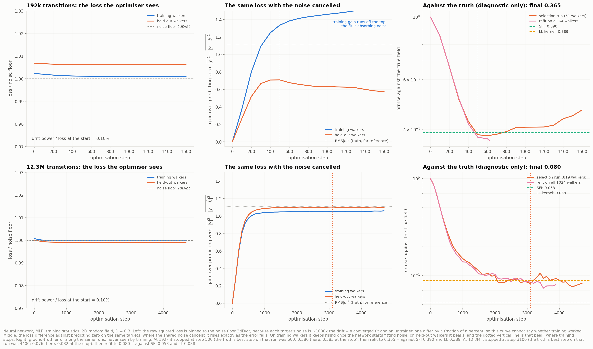

# Rung 4 — neural network regression

The estimator is [`NeuralDrift`](../../dfi/estimators/neural.py), in two architectures: an
MLP (this folder) and a CNN ([`../nn_cnn/`](../nn_cnn/)). Both come from the same study
script as rungs 1–3, on the **same walkers**, re-used from the trajectory cache:

```bash
python scripts/03_local_estimator.py --estimators nn cnn
```

## What the network learns from — trajectories only

The network is trained on one dataset at a time, exactly like SFI or a kernel, and it
never sees the true field.

- **Target.** Each observed step gives a pair `x → y = Δx/Δt`. The loss is
  `|net(x) − y|²`. Since `y = b(x) + noise` with zero-mean noise, the minimiser of that loss
  is the drift itself. This is the same fact least squares (SFI) and local averaging
  (kernels) rest on.
- **Validation.** 20% of the walkers are held out, whole walkers rather than time points,
  since consecutive steps of one walker are correlated. The loss on their increments picks
  the number of training steps, the network's smoothing parameter. Rungs 1–3 pick bin
  count, bandwidth and basis size the same way.
- **Refit.** The network is retrained on every walker for that many steps (per
  transition), and that fit is what gets scored.
- **Verified.** `fit` receives a `Trajectories` object, which holds positions, `dt`, `D`
  and the box, and no field. A fit on trajectories rebuilt from bare arrays, with and
  without the ground-truth monitor attached, gives the same stopping step and predictions
  identical to the last bit (max difference 0.0 over 5000 points). The monitor only draws
  the "against the truth" panels.

## The two architectures

| | MLP | CNN |
|---|---|---|
| input | a point, as `[sin 2πx/L, cos 2πx/L]` | nothing: a learned coarse latent |
| output | `b(x)` at that point | `b` on an `M^d` grid, multilinear in between |
| training | minibatch Adam on transitions, weights averaged (EMA 0.995) | full batch: the loss over *all* transitions is a quadratic form in the grid values, computed exactly from lattice statistics |
| smoothing | training steps | training steps **and** the grid (16², 32² or 64², by held-out loss) |
| dimensions | any | `d ≤ 3` |
| size | 3 × 128 GELU, 34k parameters | 32 channels, two upsampling blocks, ~38–46k parameters |

The CNN's lattice loss is exact, not approximate: a test checks it against the plain loss
over transitions to 1e-10.

## Training statistics (figure 04)



**The raw loss cannot show training.** Each target's noise is ~1000× the drift's power, so
the loss sits at the noise floor `2dD/Δt` from step 0: the drift is 0.10% of the starting
loss (left panels). Subtracting the nominal floor doesn't help either. The realised noise
in a few million targets differs from its expectation by more than the whole drift signal,
so "loss − floor" is routinely negative.

**What is measurable is a difference of losses on the same targets.** There the shared
noise cancels (middle panels):

`gain = mean|y|² − mean|y − b̂|² = mean|b|² − mean|b̂ − b|² + small noise`

It rises exactly as the error falls. On training walkers it keeps rising once the network
starts fitting noise, while on held-out walkers it peaks. That peak is the stopping point.

| | stopped at | truth's best step | refit → | SFI | LL |
|---|---|---|---|---|---|
| MLP, 192k | 500 (0.383) | 600 (0.380) | **0.365** | 0.390 | 0.389 |
| MLP, 12.3M | 3100 (0.082) | 4400 (0.076) | 0.080 | **0.053** | 0.088 |
| CNN, 192k | 150 (0.452) | 175 (0.450) | 0.445 | 0.390 | **0.389** |
| CNN, 12.3M | 375 (0.081) | 525 (0.077) | 0.068 | **0.053** | 0.088 |

With little data, overfitting is sharp: the held-out gain peaks clearly and the stop
lands within one check of the truth's optimum. With lots of data it plateaus, and the
peak becomes a coin toss between checkpoints whose difference is below the validation
noise. There early stopping leaves ~5% of the error on the table (0.082 against 0.076 at
the stop).

Two one-standard-error variants of the rule were tried against the truth, and each lost
somewhere:
- **Longest checkpoint within 1 SE of the best:** 1024 walkers 0.080 → 0.074, but 16
  walkers 0.34 → 0.42, because three held-out walkers give an error bar wide enough to
  accept an overfitted fit.
- **Walk forward until significantly worse:** no gain.

The plain arg-max stays. Using all held-out rows rather than a 1M subsample did help
(0.085 → 0.080).

The CNN needs 3–8× fewer steps (a full-batch step sees all the data) and overfits
correspondingly fast. At 192k the 64² grid is worse than predicting zero by step 25.

## Results, on the same walkers as every other rung

**4.8M transitions, `D = 0.3`** (figure 01): MLP **0.100**, CNN 0.115; SFI 0.097, LL 0.126.

**Noise level**, 4.8M transitions (figure 02)

| `D` | 0.05 | 0.15 | 0.4 | 1.0 |
|---|---|---|---|---|
| LL | 0.067 | 0.080 | 0.160 | 0.280 |
| SFI | **0.025** | **0.043** | **0.108** | **0.211** |
| MLP | **0.025** | 0.057 | 0.129 | 0.319 |
| CNN | 0.031 | 0.057 | 0.132 | 0.333 |

**Walkers**, 12000 steps (figure 03)

| `N` | 16 | 64 | 256 | 1024 |
|---|---|---|---|---|
| LL | 0.358 | 0.231 | 0.144 | 0.088 |
| SFI | 0.392 | **0.173** | **0.107** | **0.053** |
| MLP | **0.340** | 0.199 | 0.111 | 0.080 |
| CNN | 0.380 | 0.208 | 0.166 | 0.068 |

**Sweeps**, 4000 steps, 3 seeds (figure 06)

| walkers | 16 | 64 | 256 | 1024 |
|---|---|---|---|---|
| LL | **0.516** | 0.361 | 0.222 | 0.139 |
| SFI | 0.578 | 0.363 | **0.200** | **0.100** |
| MLP | 0.541 | **0.350** | 0.212 | 0.117 |
| CNN | 0.759 | 0.415 | 0.257 | 0.132 |

| `D` | 0.05 | 0.2 | 0.8 | 1.5 |
|---|---|---|---|---|
| LL | 0.084 | 0.162 | **0.366** | 0.576 |
| SFI | **0.042** | **0.133** | 0.433 | 0.678 |
| MLP | 0.046 | 0.143 | 0.409 | 0.633 |
| CNN | 0.057 | 0.223 | 0.506 | 0.859 |

At `σ_obs = 0.02`, every method is above 1 (MLP 1.38, CNN 1.44). That is the target bias
`b(1 + σ²/(DΔt))`, which no estimator removes.

**Where the MLP stands.**
- **Middle ranges:** it sits between SFI and the local-linear kernel, rarely best and
  rarely by much when it is.
- **Low data:** best of all at 16 walkers × 12000 steps (0.340); second to the kernel at
  16 × 4000 (0.541 vs 0.516).
- **High noise, little data:** it edges SFI at 1M transitions (`D = 0.8`: 0.409 vs 0.433;
  `D = 1.5`: 0.633 vs 0.678). With 4.8M transitions at `D = 1`, SFI wins clearly (0.211 vs
  0.319).
- **Large budgets:** it loses to SFI, whose Fourier basis is the exact family these fields
  are drawn from.

**Where the CNN stands.** It is behind the MLP almost everywhere, noisiest at small budgets
(0.759 at 16 walkers), and not monotone in data (128 walkers 0.463 against 64 walkers
0.415: the grid choice flips between seeds). Its exception is the largest budget, where the
exact full-batch gradients stop it closer to the optimum (0.068 vs MLP 0.080 at 1024
walkers). Nothing about convolution helps here: its strengths are locality and weight
sharing *across many images*, and a per-dataset fit has exactly one image.

## Dimension (figure 05)

At 6.1M transitions:

| `d` | 2 | 3 | 5 | 10 |
|---|---|---|---|---|
| LL | 0.116 | 0.261 | **0.925** | 1.004 |
| SFI | **0.082** | **0.195** | 0.946 | **1.002** |
| MLP | 0.093 | 0.223 | 0.927 | 1.019 |
| CNN | 0.088 | 0.224 | — | — |
| MLP held-out gain / RMS\|b\|² | 0.977 | 0.962 | 0.181 | 0.006 |

The guide expected the network to overtake the basis around `d = 4–6`. **It doesn't, and
the reason is not capacity.** Two checks at `d = 5`, on the same 6M positions:

1. **Capacity.** Trained on the *exact* drift at those positions (no noise), an MLP of the same
   architecture (3 GELU layers, widened to 256 and 512) reaches nrmse 0.077 and 0.040. The network can represent
   the 5D field.
2. **Information.** The targets were redrawn with the noise scaled down, which is
   equivalent to multiplying the data by `1/scale²`:

| noise scale (≈ data ×) | 1 (1×) | 0.3 (11×) | 0.1 (100×) | 0 (∞) |
|---|---|---|---|---|
| MLP (width 256) | 0.95 | 0.538 | 0.248 | 0.077 |
| SFI (CV basis) | 0.947 | 0.552 | **0.201** | **0.011** |

(Positions are 6M points from the real `d = 5` trajectories; only the targets are
synthetic, `b(x) + scale · noise`. The MLP here ran a fixed 8000-step one-cycle schedule
rather than `NeuralDrift`'s early stopping; SFI chose its basis by cross-validation, up to
1,903 functions.)

The field is learnable in 5D, but only with ~10–100× this budget. At every budget the two
methods track each other. `suggest_dt` shrinks Δt with d (2.7e-4 at `d = 5`), so each
increment carries noise 48× the drift per component. The field also has about
`(L/ℓ)^d` independent correlation volumes: 20 in 2D, 88 in 3D, 1,700 in 5D, 3 million in
10D. No function class avoids having to resolve those. A network's parameter count grows
like `d`, but that helps only when the *field* has structure much simpler than its
dimension. These fields are drawn from lattice Fourier modes, which is precisely SFI's
basis, so they give the network no such opening.

## Can one network be carried across dimensions?

**As built here, no.**
- Each fit is the estimate of one field. A 2D field and a 3D field are different
  functions, so there is nothing to transfer except the recipe, and the recipe transfers
  unchanged: only the input width `2d` changes.
- The CNN cannot even be *run* past `d = 3`, since its output is an `M^d` grid and its
  kernels are `3^d`.

**For a network trained across many fields and applied without retraining** (the next
step, rung 4b), the answer is still "train per dimension":
- A dimension-agnostic architecture exists: treat the transitions as a set, and the
  coordinates as tokens with shared weights, equivariant under permuting axes.
- But what such a model learns is the relation between data density, noise level and
  field roughness, and that changes character with `d`. Correlation volumes jump from 20 to
  1,700 between 2D and 5D, and the useful Δt shrinks.
- A model trained in 2D would be far outside its training distribution in 5D. At most a
  shared backbone could be pre-trained across dimensions and fine-tuned in each.
