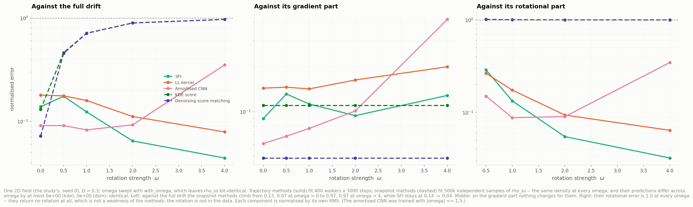
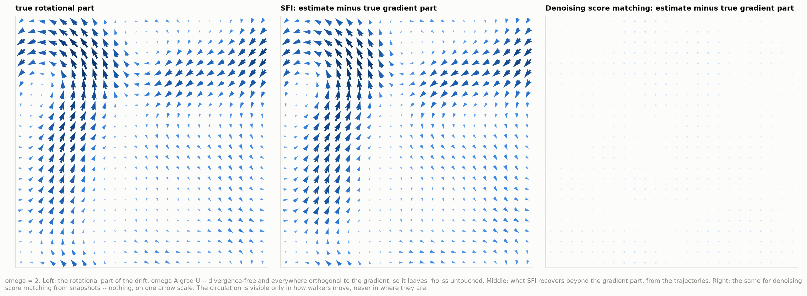
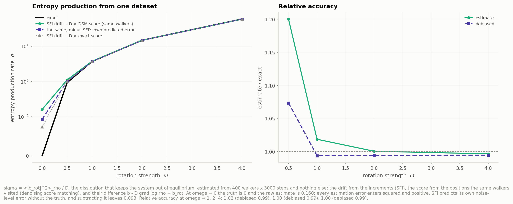
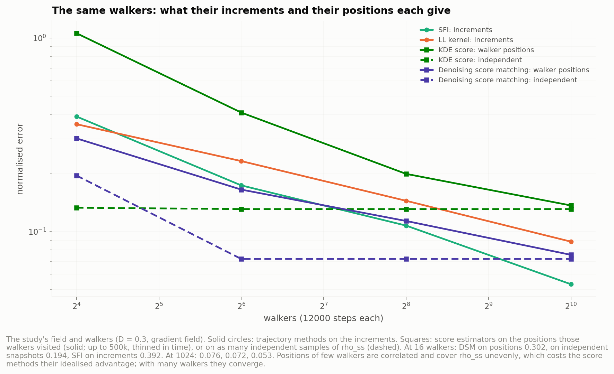

# Rung 5 — score-based estimation from snapshots

The estimators are [`KDEScore` and `DenoisingScoreMatching`](../../dfi/estimators/score.py).
They never see trajectories, only **positions without time order**, plus the known `D`.

```bash
python scripts/08_score_study.py                          # identifiability, entropy production, positions
python scripts/03_local_estimator.py --estimators kde dsm # the six shared figures -> ../score_kde, ../score_dsm
```

## The idea

At equilibrium, `ρ_ss ∝ exp(−U/D)`, so

  **∇ log ρ_ss(x) = −∇U/D = b(x)/D.**

The score of the stationary density *is* the drift, up to `D`. Estimating a score from
samples is what training a diffusion model does, so denoising score matching here is not
decoration: it estimates the physical quantity directly.

The identity holds **only for gradient drift**. The fields add a rotational part
`ω A∇U`, which is divergence-free and orthogonal to `∇ρ_ss`, so `ρ_ss` stays *exactly*
the same for every `ω`. A snapshot therefore cannot contain the rotation, whatever the
method.

## The two estimators

**KDE score.** A Gaussian kernel density, differentiated in closed form. The bandwidth is
chosen by held-out **score matching** (Hyvärinen):

  `J(s) = E[½|s|² + ∇·s]`

It equals half the squared error against the true score plus a constant, so it ranks
bandwidths by score error without knowing the truth. The Gaussian kernel gives `∇·s` in
closed form. Held-out *likelihood*, the right criterion for the density itself, picks a
smaller bandwidth: differentiating amplifies noise, so the score needs more smoothing
than the density (figure `score_kde/04`).

**Denoising score matching.** An MLP `s(x, σ)` (3 × 256, sin/cos inputs on the torus)
trained on

  `E |σ s(x + σε, σ) + ε|²`

with `σ` log-uniform in [0.01, 0.5]. That is diffusion-model training on the snapshots.
The noise level the score is *read* at is chosen by the same held-out score-matching loss,
with `∇·s` computed by autograd. Small `σ` is the least smoothed but the least trained.

Both need `D`. From snapshots alone only `U/D` is visible, so the drift is identifiable
only up to that factor.

## 1. Identifiability (figure 20)



One field (the study's), `D = 0.3`. `ω` goes from 0 to 4 via `with_omega`, which leaves
`ρ_ss` bit-identical. Trajectory methods fit 400 walkers × 3000 steps; snapshot methods fit
500k independent samples of `ρ_ss`.

| nrmse against the full drift | ω = 0 | 0.5 | 1 | 2 | 4 |
|---|---|---|---|---|---|
| SFI (trajectories) | 0.139 | 0.175 | 0.123 | 0.065 | **0.044** |
| LL kernel (trajectories) | 0.179 | 0.177 | 0.159 | 0.111 | 0.079 |
| amortised CNN (trajectories) | 0.091 | **0.091** | **0.083** | 0.093 | 0.352 |
| KDE score (snapshots) | 0.130 | 0.463 | 0.713 | 0.897 | 0.971 |
| DSM (snapshots) | **0.072** | 0.456 | 0.712 | 0.897 | 0.971 |

- **Snapshot predictions do not depend on `ω` at all**: the largest difference across the
  five values is 0.0, to the last bit, for both methods.
  - Against the gradient part their error is flat (KDE 0.110, DSM 0.049).
  - Against the rotational part it is 1.00 at every `ω`: they return no rotation.
  - Against the full drift the error therefore climbs towards `ω/√(1+ω²)`: 0.45, 0.71,
    0.89, 0.97.
- **Trajectory methods get better with `ω`.** At fixed `|∇U|`, a stronger rotation
  makes the drift larger against the same noise.
- **The amortised CNN** does well up to `ω = 2` and fails at `ω = 4`, outside its trained
  `|ω| ≤ 1.5`.

On a gradient field (`ω = 0`), DSM on 500k snapshots scores 0.072, better than SFI on
1.2M transitions (0.139). Snapshots are not the weaker data when the system is at
equilibrium; they are blind only to what breaks equilibrium.



## 2. Entropy production from one dataset (figure 22)



The rotational part is the drift minus `D` times the score, `b_rot = b − D∇log ρ`. The
entropy production rate `σ = ⟨|b_rot|²⟩_ρ / D` is the dissipation that keeps the system
out of equilibrium. Everything here comes from one set of 400 walkers × 3000 steps:
- `b` from the increments (SFI);
- the score from the positions *the same walkers* visited (DSM);
- the average over those positions.

| ω | exact | estimate | minus SFI's own predicted error | with the exact score |
|---|---|---|---|---|
| 0 | 0 | 0.160 | 0.093 | 0.074 |
| 0.5 | 0.924 | 1.109 (+20%) | 0.992 (+7%) | 1.021 |
| 1 | 3.695 | 3.763 (+1.8%) | 3.671 (−0.6%) | 3.687 |
| 2 | 14.78 | 14.79 (+0.0%) | 14.69 (−0.6%) | 14.72 |
| 4 | 59.12 | 58.91 (−0.4%) | 58.79 (−0.6%) | 58.88 |

- **Estimation error enters squared, so it always adds.** At `ω = 0` the estimate is 0.16
  instead of 0. SFI predicts its own noise-level error without the truth, and subtracting
  it halves that floor (0.09).
- **The floor limits what can be detected.** At `ω = 0` it comes about equally from the
  two estimates: 0.160 with DSM's score, 0.074 with the exact score, and what remains is
  SFI's drift error. A dissipation below ~0.1 is hard to tell from zero at this budget.
  From `ω = 1` on, the estimate is within 2%.
- **Both families are needed.** Trajectories alone give `b`; snapshots alone give the
  equilibrium part. Their difference is the part that breaks detailed balance.

## 3. Positions from the walkers, not ideal snapshots (figure 23)



The snapshots above are an idealisation: independent samples of the exact `ρ_ss`. Real
positions come from the walkers, correlated in time and unevenly spread when there are
few. On the study's walkers (gradient field, 12000 steps each; positions thinned to at
most 500k):

| walkers | 16 | 64 | 256 | 1024 |
|---|---|---|---|---|
| SFI on increments | 0.392 | 0.173 | 0.107 | **0.053** |
| LL kernel on increments | 0.358 | 0.231 | 0.144 | 0.088 |
| DSM on the walkers' positions | **0.302** | **0.164** | 0.113 | 0.076 |
| DSM on independent snapshots | 0.194 | 0.072 | 0.072 | 0.072 |
| KDE on the walkers' positions | 1.058 | 0.411 | 0.198 | 0.136 |
| KDE on independent snapshots | 0.132 | 0.130 | 0.130 | 0.130 |

- **Positions beat increments when data is scarce.** At 16 and 64 walkers, DSM on
  positions beats both trajectory methods on the *same walkers*. The increments' noise
  (`√(2D/Δt)` per component) is so large that where walkers are carries more about a
  gradient drift than how they step. With enough walkers SFI wins, since increments keep
  improving while positions carry correlated information.
- **The idealisation is worth a lot with few walkers:** 0.19 against 0.30 at 16.
- **KDE on few walkers' positions fails (1.06), and the fault is its bandwidth
  cross-validation.** It splits samples at random. With correlated positions, held-out
  points sit next to training points, so the criterion rewards a too-small bandwidth.
  The trajectory rungs avoid this by splitting by walker; a snapshot estimator is handed
  positions without walker labels. Checked: at 16 walkers the criterion drove the
  bandwidth to the bottom of its grid (0.03, nrmse 1.06), while a fixed 0.10 gives 0.35.
  The fix would be to pass walker ids or split in time.
- **DSM is less affected.** Its training loss adds fresh noise to every point, which
  smooths the correlation away.

## On every rung's walkers (the six shared figures)

See [`../score_kde/`](../score_kde/) and [`../score_dsm/`](../score_dsm/): the same six
figures as every other rung, with snapshots matched to the transition count (capped at
500k), plus the measurement-noise sweep (snapshots carry the same position noise).
Numbers in [`../local_study/`](../local_study/).

**Recovery on a gradient field** (the study's walkers; snapshots matched to the transition
count, capped at 500k):

| | 4.8M | `D` = 0.05 | 0.15 | 0.4 | 1.0 | 16 walkers | 1024 |
|---|---|---|---|---|---|---|---|
| SFI | 0.097 | 0.025 | 0.043 | 0.108 | 0.211 | 0.392 | 0.053 |
| amortised CNN | 0.060 | 0.031 | 0.038 | 0.074 | 0.134 | 0.257 | 0.043 |
| KDE score | 0.130 | 0.131 | 0.138 | 0.145 | 0.843 | 0.132 | 0.130 |
| DSM | **0.072** | 0.053 | 0.055 | 0.083 | 0.164 | 0.194 | 0.072 |

The snapshot methods flatten out: past ~200k snapshots the KDE is capped at 100k samples
and DSM has what it needs, so more walkers change nothing. At `D = 1` the KDE's bandwidth
search runs away (h = 0.605, nrmse 0.84): the density is nearly flat, its gradient tiny, and
the criterion has almost no signal to lock onto. DSM handles the same case at 0.164.

**Dimension** (6.1M transitions, up to 500k snapshots):

| `d` | 2 | 3 | 5 | 10 |
|---|---|---|---|---|
| SFI (trajectories) | 0.082 | 0.195 | 0.946 | 1.002 |
| LL kernel (trajectories) | 0.116 | 0.261 | 0.925 | 1.004 |
| MLP (trajectories) | 0.093 | 0.223 | 0.927 | 1.019 |
| KDE score (snapshots) | 0.128 | 0.231 | 0.983 | 0.997 |
| DSM (snapshots) | **0.072** | **0.142** | **0.625** | 0.996 |

**At `d = 5` denoising score matching is the only method that recovers anything** (0.63
against ~0.93 for every trajectory method). This is the crossover the guide expected for
neural methods, and it appears on the snapshot side: a neural score fitted to 500k
positions extracts more of a gradient field in 5D than any method reading 6.1M increments.
It comes with two conditions: the field must be a gradient field (otherwise the rotational
part is invisible), and the snapshots here are the idealised kind. By `d = 10` it is gone
too.

**Measurement noise** (sweeps, 4000 steps, 3 seeds):

| σ_obs = 0.02 | binned | LL | SFI | MLP | amortised | KDE | DSM |
|---|---|---|---|---|---|---|---|
| nrmse | 1.56 | 1.25 | 1.43 | 1.38 | 0.63 | **0.14** | **0.08** |

**This is the snapshot methods' other structural advantage.** Position noise biases the
Kramers–Moyal target to `b(1 + σ²/(DΔt))` and wrecks every trajectory method. On snapshots
it only convolves `ρ_ss` with a narrow Gaussian, which barely moves its score: KDE goes
0.134 → 0.140, DSM 0.075 → 0.080. If positions are measured badly and the system is at
equilibrium, snapshots are the data to use.

| sweeps | 16 → 1024 walkers | best `D` |
|---|---|---|
| KDE score | 0.157 → 0.135 | 0.2 (0.134) |
| DSM | 0.614 → 0.077 | 0.05 (0.050) |
